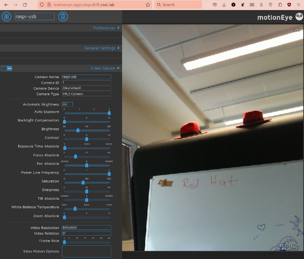
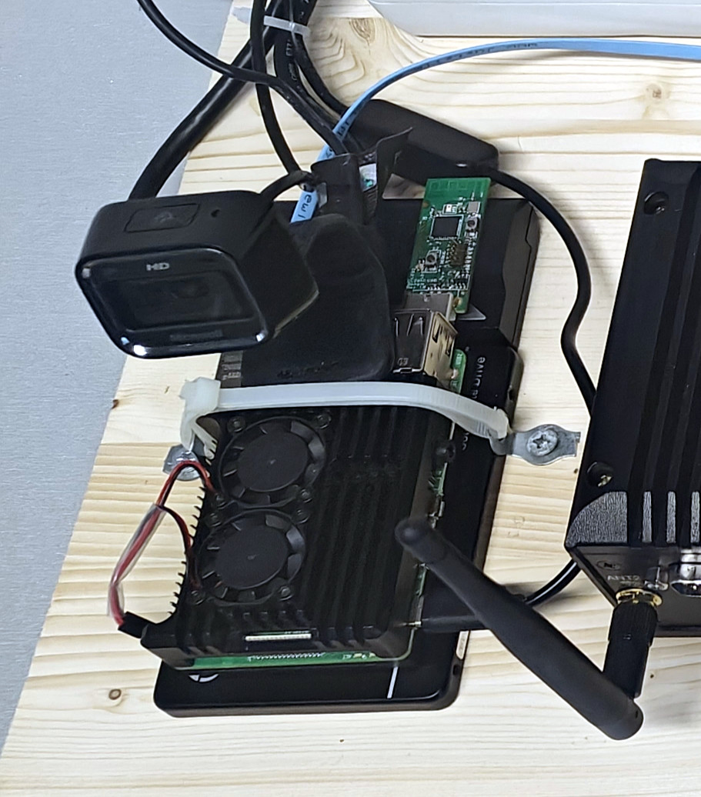

MotionEye surveillance on MicroShift
====================================

Here's short memo what was done to get
[MotionEye](https://github.com/motioneye-project/motioneye) run on
[MicroShift](https://github.com/openshift/microshift/) (minimum
[OpenShift](https://www.redhat.com/en/technologies/cloud-computing/openshift)
kubernetes environment). I use the (outdated?) MotionEye container from
Dockerhub as such, and make MicroShift provide the access to storage and
camera for it.



This was originally done for our demo environment, to get camera feed into
our edge lab for AI/ML demos. This component demonstrates how to use kubernetes
API to provision software, configuration and updates to edge devices. The device
in use is Raspberry Pi 4 with external SSD drive and USB camera.

Kubernetes definitions provide storage for the both configurations and media
storage for MotionEye. It also exposes routes for MotionEye web UI, video
stream and motion configuration separately.

# Configurations

Configuration is split into different files, and applied in this order:

1. **[motioneye-namespace.yaml](./base/motioneye-namespace.yaml)** - creates namespace, loosening the permissions
2. **[motioneye-scc.yaml](./base/motioneye-scc.yaml)** - Security Context Constraint for HW access
3. **[motioneye-clusterrole.yaml](./base/motioneye-clusterrole.yaml)** - create role to allow access to video HW.  XXX
4. **[motioneye-sa.yaml](./base/motioneye-sa.yaml)** - Service Account with access to HW
5. **[motioneye-clusterrolebinding.yaml](./base/motioneye-clusterrolebinding.yaml)** - binds the SA to correct SCC
6. **[motioneye-storage.yaml](./base/motioneye-storage.yaml)** - Persistent storages for media and conf
7. **[motioneye-deployment.yaml](./base/motioneye-deployment.yaml)** - creates the container
8. **[motioneye-service.yaml](./base/motioneye-service.yaml)** - Services to different TCP ports
9. **[motioneye-route.yaml](./base/motioneye-route.yaml)** - Expose the routes to application
10. **[motioneye-argocd-app](./motioneye-argocd-app.yaml)** - ArgoCD automation to use this repo

# Demo setup



Raspberry Pi is installed with
[Fedora CoreOS](https://fedoraproject.org/coreos/). I then made Fedora 39
container with build tools and built rpms for MicroShift for arm in container.

## Create build container

```
mkdir src
podman run --name fed39 -ti --hostname fed39 -v $PWD/src:/src:z fedora:39
```

## Build microshift rpms for arm Fedora

(FYI, if you don't want to build this, check
[Wolframs FrankenShift guide](https://github.com/wrichter/frankenshift)
for just using rhel rpms.)

Microshift dependencies need to patched to satisfy Fedora dependencies:

```
diff --git a/packaging/rpm/microshift.spec b/packaging/rpm/microshift.spec
index 66652f07b..3e3a28a5e 100644
--- a/packaging/rpm/microshift.spec
+++ b/packaging/rpm/microshift.spec
@@ -65,7 +65,9 @@ BuildRequires: golang
 # DO NOT REMOVE
 
 Requires: cri-o >= 1.25
-Requires: cri-tools >= 1.25
+# Requires: cri-o
+# Requires: cri-tools >= 1.25
+Requires: cri-tools
 Requires: iptables
 Requires: microshift-selinux = %{version}
 Requires: microshift-networking = %{version}
@@ -73,7 +75,7 @@ Requires: microshift-greenboot = %{version}
 Requires: conntrack-tools
 Requires: sos
 Requires: crun
-Requires: openshift-clients
+# Requires: openshift-clients
 
 %{?systemd_requires}
 
@@ -108,7 +110,8 @@ The microshift-selinux package provides the SELinux policy modules required by M
 %package networking
 Summary: Networking components for MicroShift
 Requires: microshift = %{version}
-Requires: openvswitch3.1
+# Requires: openvswitch3.1
+Requires: openvswitch
 Requires: NetworkManager
 Requires: NetworkManager-ovs
 Requires: jq

```

Build rpms, the following commands are run in the container:

```
cd src
dnf install -y git make golang selinux-policy-devel rpm-build jq bash-completion which systemd
git clone https://github.com/openshift/microshift.git -b release-4.14 microshift-4.14
cd microshift-4.14/
vi packaging/rpm/microshift.spec
make rpm
exit
```

## Install Microshift

```
sudo rpm-ostree install src/microshift-4.14/_output/rpmbuild/RPMS/*/*.rpm
```

## Configure MicroShift

I don't go into details explaining here, here's my config:

```
$ grep -v '^ *$\|^ *#' /etc/microshift/config.yaml
dns:
  baseDomain: raspishift.cool.lab
network:
  clusterNetwork:
  serviceNetwork:
node:
  nodeIP: '192.168.1.13'
apiServer:
  subjectAltNames:
    - raspishift
    - 192.168.1.13
    - api.raspishift.cool.lab
debugging:
etcd:
```

And storage to get LVM CSI

```
$ grep -v '^ *$\|^ *#' /etc/microshift/lvmd.yaml
socket-name: /run/lvmd/lvmd.socket
device-classes:
  - name: usbshift
    volume-group: ushift
    spare-gb: 5
    default: true
```

You also need to add pull secret and start the microshift service.

## Apply the configs

The config files are listed above, run them in in the given order using the
following command:

```
oc create -f base/<yaml file>
```

## Kustomize

I added [kustomize](https://github.com/kubernetes-sigs/kustomize)
to be able to apply the configuration to differrent microshifts. The resource
files are in [base](./base) directory and the cluster specific changes are in
[overlays](./overlays) directory.

## ArgoCD automation

We want ArgoCD to make sure the given edge box runs MotionEye, so we use
OpenShift GitOps from the nearby edge Single Node OpenShift (SNO) gitops
to push all the configs to given cluster.

```
oc apply -f motioneye-argocd-app.yaml
```

# Running MotionEye with podman

You need to verify your user is part of video group, or you manually give
permissions to video device for your user by ```chmod o+rw /dev/video0```
or by udev rule.

Starting this as podman non-root container would be super easy, one command:

```
mkdir motioneye-conf motioneye-video
podman run --name="motioneye" \
  -p 8765:8765  -p 8080:8080 -p 8081:8081 \
  --hostname="motioneye" \
  --device /dev/video0 \
  -v /var/home/core/motioneye-conf:/etc/motioneye:z \
  -v /var/home/core/motioneye-video:/var/lib/motioneye:z \
  -v /etc/localtime:/etc/localtime:ro \
  --rm --detach=true --privileged \
  ccrisan/motioneye:master-armhf
```

Wrap around the systemd files to make it start at boot.

Author: Ilkka Tengvall
License: GPLv3
